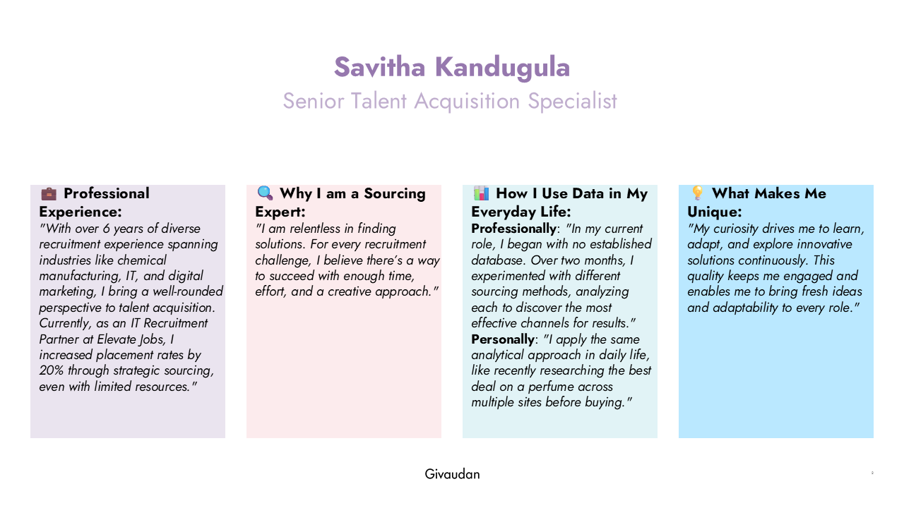
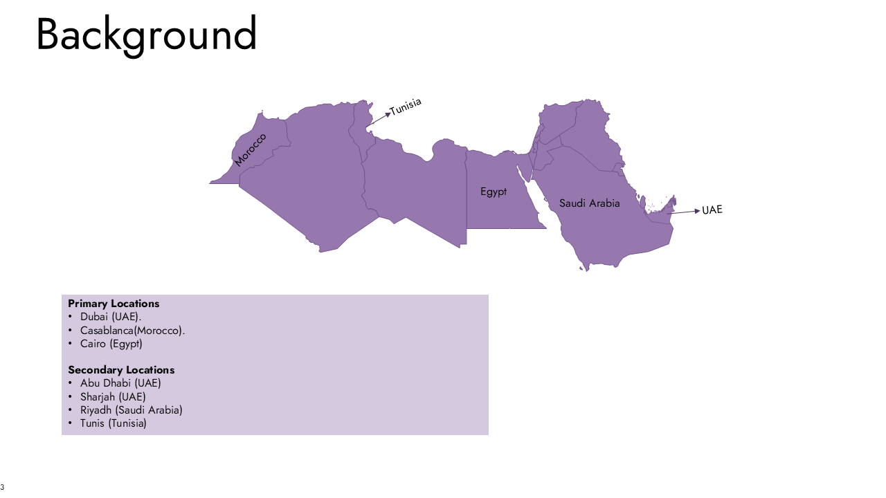
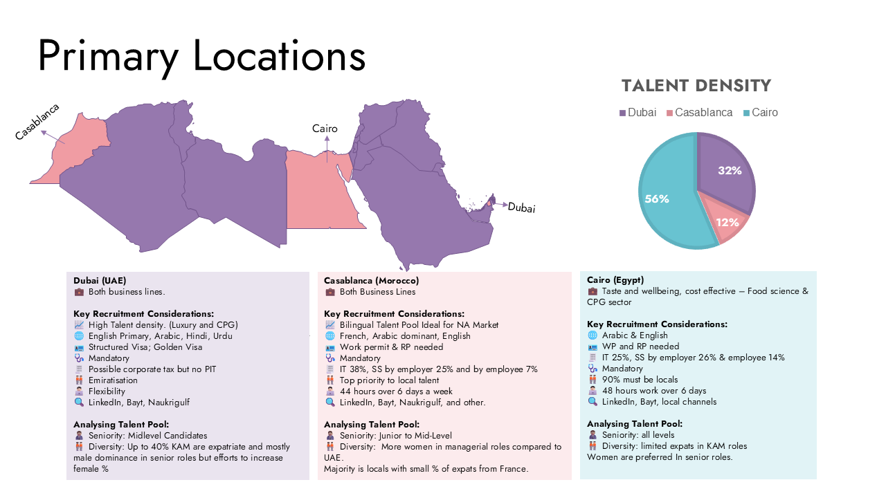
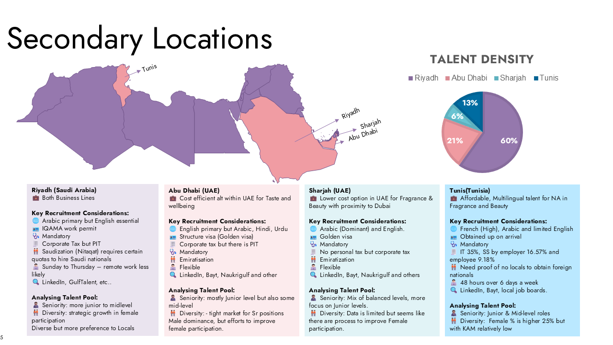
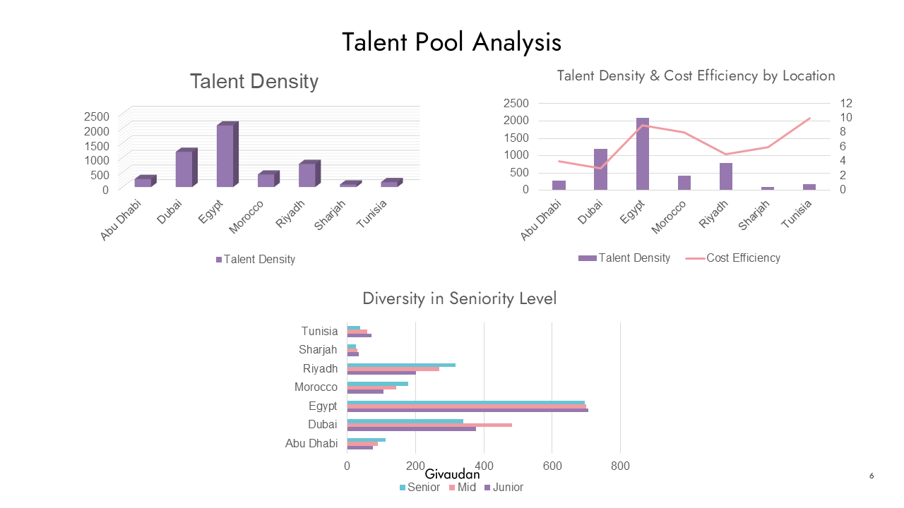
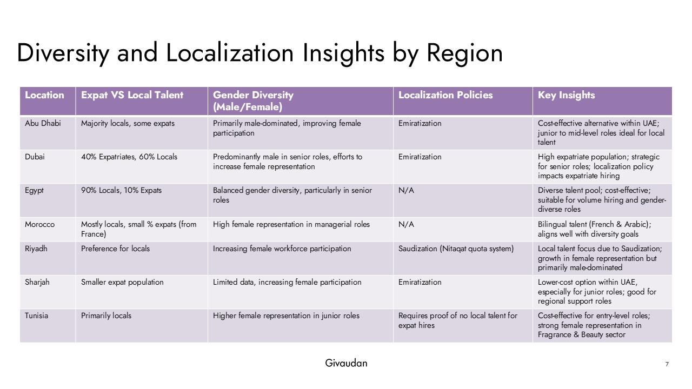
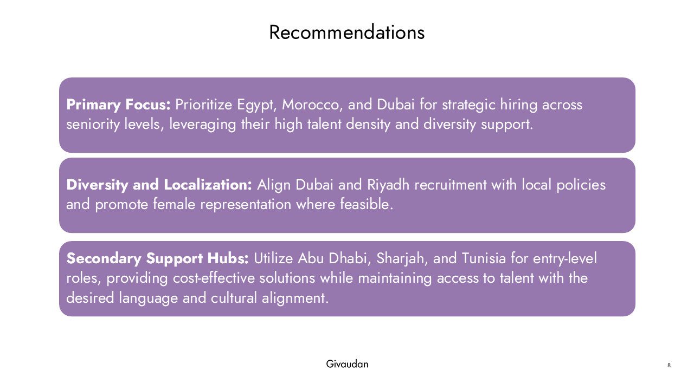

# Business Analysis Case Study: Data-Driven Talent Acquisition Strategies

This case study presents a comprehensive analysis of regional talent acquisition strategies across multiple markets. It highlights key recruitment considerations and data-driven insights into how to optimize sourcing and hiring practices.

---

## Slide 1: Introduction

**Date:** November 2024  
**Role:** Digital TA Specialist Interview Assignment

---

## Slide 2: Professional Experience & Background

- Over 6 years of diverse recruitment experience in industries such as chemical manufacturing, IT, and digital marketing.
- Current role as an IT Recruitment Partner at Elevate Jobs, achieving a 20% increase in placement rates.
- Emphasis on analytical and creative problem-solving in talent acquisition.

---

## Slide 3: Methodology

- Conducted a detailed analysis of regional talent pools.
- Assessed factors like language requirements, visa/work permit regulations, and local vs. expatriate candidate dynamics.
- Compared sourcing channels (LinkedIn, Bayt, Naukrigulf, etc.) to determine the most effective strategies.

---

## Slide 4: Regional Analysis

**Key Regions:**
- **Dubai:** High talent density with structured visa options and diverse language skills.
- **Casablanca & Cairo:** Different challenges in balancing local and expatriate talent with unique language and regulatory requirements.
- **Tunis, Abu Dhabi, Sharjah, Riyadh:** Each with specific considerations regarding work permits, cost efficiency, and recruitment diversity.

---

## Slide 5: Recommendations & Conclusion

- **Tailored Strategy:** Avoid a one-size-fits-all approach; customize recruitment strategies per region.
- **Data-Driven Insights:** Use analytics to select the most effective sourcing channels.
- **Balanced Talent Pool:** Strive for a mix of local and expatriate talent to enhance diversity and meet regulatory standards.

These recommendations underscore the importance of leveraging data and market-specific insights to drive successful recruitment outcomes.

---

## Final Thoughts

This case study is a testament to the power of a data-driven approach in talent acquisition. It illustrates the ability to analyze complex datasets, extract actionable insights, and develop tailored recommendations—key skills for a transition into business analysis.

